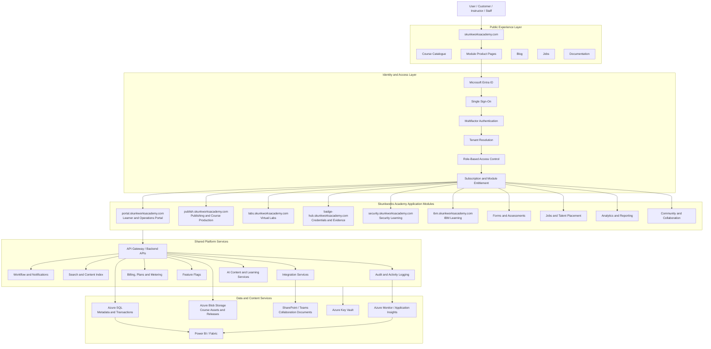
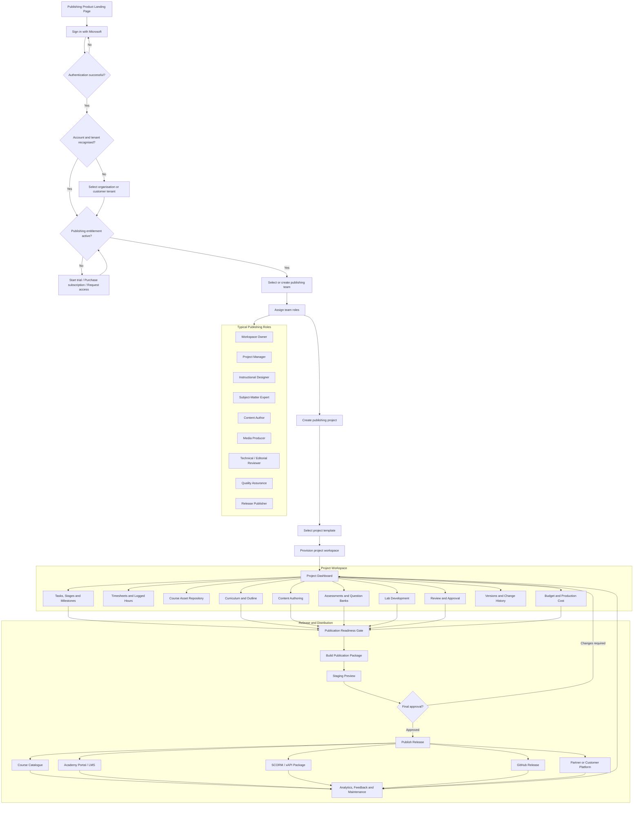
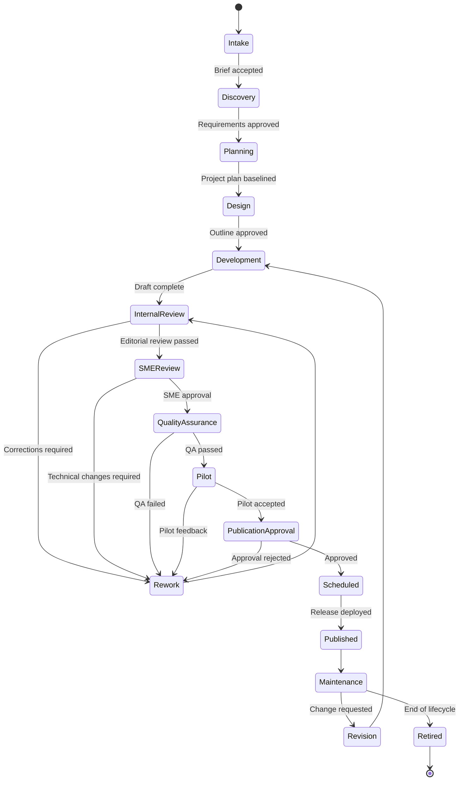
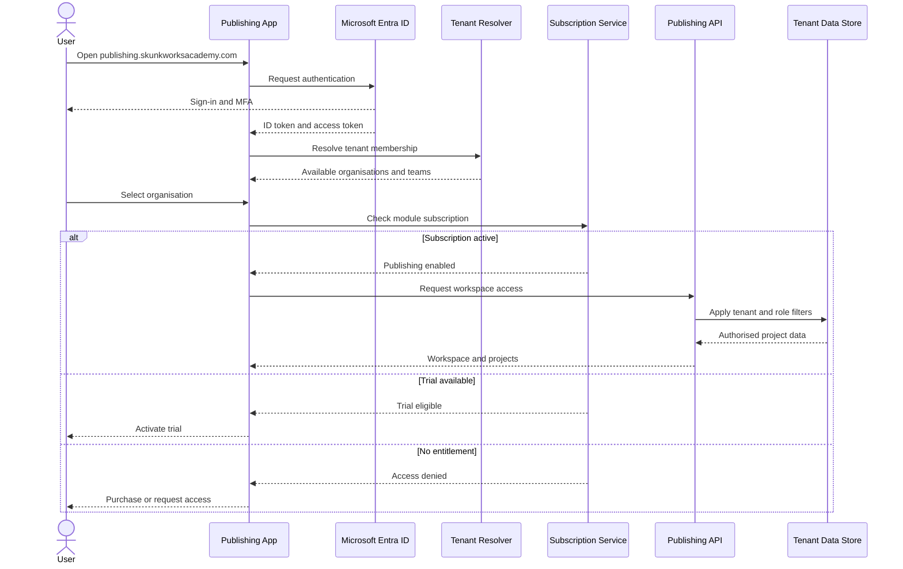
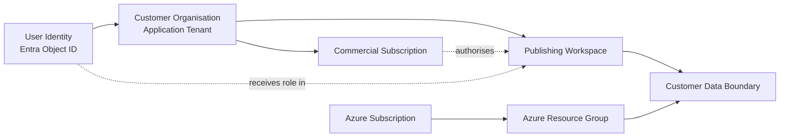
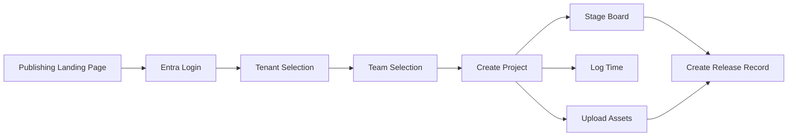

# **Application hierarchy and publishing workflow** 

For the Skunkworks Academy ecosystem. It treats Publishing as a paid, multi-tenant module while retaining shared identity, navigation, governance, analytics, and platform services.

Your current ecosystem landing page already identifies publishing as part of the unified Academy navigation, and the Jobs module already links to `publish.skunkworksacademy.com`. fileciteturn2file10 fileciteturn2file15

## 1. Entire application hierarchy



The existing Portal page is already positioned as the learner, instructor, and operations entry point, while the Labs module follows the shared theme, light/dark mode, navigation, canonical metadata, and Academy branding. fileciteturn2file9 fileciteturn2file11

---

## 2. Publishing module user workflow



---

## 3. Course production stage model



### Recommended stage gates

Each stage should require explicit evidence before progression:

| Stage gate | Required evidence |
|---|---|
| Intake approved | Brief, customer, owner, budget, intended outcome |
| Design approved | Audience, objectives, outline, assessment strategy |
| Development complete | Courseware, slides, labs, facilitator assets |
| QA passed | Technical, editorial, accessibility and brand checks |
| Publication approved | Rights, licensing, security and commercial approval |
| Release published | Version number, release notes, deployment evidence |
| Maintenance review | Usage analytics, feedback and revision decision |

---

## 4. Multi-tenant identity and entitlement workflow



### Important tenant rule

A user identity, Azure subscription, customer tenant, billing account and application workspace are **not the same boundary**. Keep them separately modelled:



Your Azure sponsorship or partner credits remain attached to the qualifying Azure billing arrangement. They should not be represented as credits transferred into a customer tenant. A safer SaaS model is:

- Skunkworks hosts the SaaS platform in its controlled Azure subscription.
- Customers receive logical tenant isolation inside the application.
- Skunkworks meters usage and charges the customer commercially.
- Customer-owned Azure resources are provisioned separately only where required.
- Azure Lighthouse can provide delegated management, but it does not transfer your sponsorship credits to the customer.

---

## 5. Recommended GitHub organisation and repository hierarchy

```mermaid
flowchart TB
    Org["github.com/skunkworks-academy"]

    Org --> CommunityRepo[".github<br/>Organisation profile, templates and shared policies"]
    Org --> WebRepo["academy-web<br/>Public website and unified navigation"]
    Org --> PortalRepo["academy-portal<br/>Authenticated portal shell"]
    Org --> PublishRepo["academy-publishing<br/>Publishing frontend"]
    Org --> APIRepo["academy-platform-api<br/>Shared backend APIs"]
    Org --> IdentityRepo["academy-identity<br/>Entra integration and RBAC"]
    Org --> InfraRepo["academy-infrastructure<br/>Bicep / Terraform / Azure deployment"]
    Org --> DesignRepo["academy-design-system<br/>Navigation, tokens and components"]
    Org --> WorkflowRepo["academy-workflows<br/>Notifications and automation"]
    Org --> AnalyticsRepo["academy-analytics<br/>Telemetry and reporting"]
    Org --> DocsRepo["academy-docs<br/>Architecture and operational documentation"]
    Org --> TemplatesRepo["course-project-templates<br/>Reusable course project templates"]
    Org --> CourseRepos["course-*<br/>Individual course source repositories"]

    PublishRepo --> PublishWeb["Publishing UI"]
    PublishRepo --> ProjectUI["Project and team screens"]
    PublishRepo --> TimeUI["Time tracking"]
    PublishRepo --> ReleaseUI["Release management"]

    APIRepo --> TenantAPI["Tenant API"]
    APIRepo --> ProjectAPI["Project API"]
    APIRepo --> TimeAPI["Timesheet API"]
    APIRepo --> AssetAPI["Asset API"]
    APIRepo --> ReleaseAPI["Release API"]
    APIRepo --> BillingAPI["Entitlement API"]

    IdentityRepo --> EntraConfig["App registrations"]
    IdentityRepo --> Claims["Roles and claims"]
    IdentityRepo --> Consent["Tenant consent"]
    IdentityRepo --> Policies["Conditional Access guidance"]

    InfraRepo --> Dev["Development"]
    InfraRepo --> Test["Test"]
    InfraRepo --> Stage["Staging"]
    InfraRepo --> Prod["Production"]
```



### Suggested monorepo alternative

Since you are currently the sole developer, a monorepo is likely easier during the first implementation:

```text
skunkworks-academy-platform/
├── apps/
│   ├── web/                    # skunkworksacademy.com
│   ├── portal/                 # portal.skunkworksacademy.com
│   ├── publishing/             # publish.skunkworksacademy.com
│   ├── labs/                   # labs.skunkworksacademy.com
│   └── jobs/                   # jobs.skunkworksacademy.com
│
├── services/
│   ├── api/
│   ├── identity/
│   ├── entitlements/
│   ├── notifications/
│   ├── analytics/
│   └── publishing-engine/
│
├── packages/
│   ├── ui/
│   ├── navigation/
│   ├── auth/
│   ├── database/
│   ├── validation/
│   ├── telemetry/
│   └── configuration/
│
├── infrastructure/
│   ├── bicep/
│   ├── environments/
│   │   ├── development/
│   │   ├── staging/
│   │   └── production/
│   └── policies/
│
├── docs/
│   ├── architecture/
│   ├── identity/
│   ├── tenancy/
│   ├── security/
│   ├── publishing/
│   └── operations/
│
├── .github/
│   ├── workflows/
│   ├── ISSUE_TEMPLATE/
│   ├── PULL_REQUEST_TEMPLATE.md
│   ├── CODEOWNERS
│   └── dependabot.yml
│
└── README.md
```

This aligns with the existing repository-oriented model, which already uses GitHub-backed course content, assessment assets, deployment validation scripts, and module-specific web pages. fileciteturn2file3 fileciteturn2file13

---

## 6. Deployment and release workflow

```mermaid
flowchart LR
    Developer["Developer"]
    Branch["Feature Branch"]
    PR["Pull Request"]
    CI["CI Validation"]
    Security["Security Scanning"]
    Preview["Preview Deployment"]
    Review["Manual Review"]
    Main["Merge to Main"]
    Stage["Staging Deployment"]
    Tests["Integration and E2E Tests"]
    Approval["Production Approval"]
    Tag["Version Tag"]
    Release["GitHub Release"]
    Production["Azure Production"]
    Monitor["Application Insights"]
    Rollback["Rollback"]

    Developer --> Branch
    Branch --> PR
    PR --> CI
    CI --> Security
    Security --> Preview
    Preview --> Review

    Review -- Changes --> Branch
    Review -- Approved --> Main

    Main --> Stage
    Stage --> Tests

    Tests -- Failed --> Branch
    Tests -- Passed --> Approval

    Approval --> Tag
    Tag --> Release
    Release --> Production
    Production --> Monitor

    Monitor -- Healthy --> Production
    Monitor -- Critical failure --> Rollback
    Rollback --> Production
```



## Recommended first implementation boundary

Do **not** build every module simultaneously. The first vertical slice should be:



That first slice proves the critical architecture:

1. Multi-tenant Entra authentication.
2. Subscription entitlement.
3. Team and role resolution.
4. Project isolation.
5. File and metadata storage.
6. Workflow state management.
7. Auditable release creation.

Everything else—AI assistance, SCORM generation, advanced analytics, marketplace billing and external LMS publishing—can be added after that foundation is stable.
