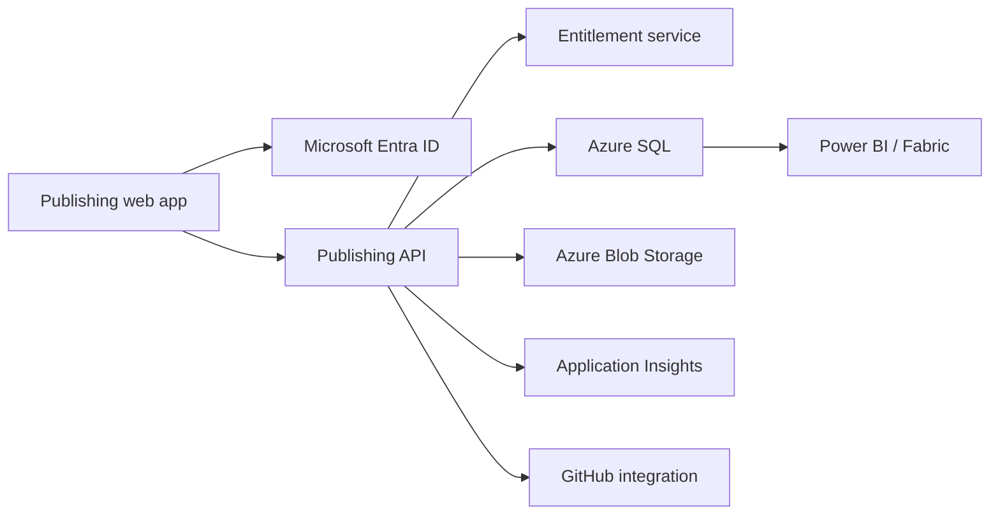

# Publishing module implementation roadmap

## Current MVP boundary

The first release is a browser-based vertical slice proving the user journey and information architecture:

1. Product landing page.
2. Microsoft sign-in entry point (simulated adapter).
3. Organisation and publishing-team selection.
4. Project workspace creation.
5. Stage-board progression.
6. Time-entry logging.
7. Course asset registration.
8. Release-readiness checklist and release record.

The MVP stores state in memory only. It deliberately does not claim production authentication, durable storage, billing or tenant isolation.

## Production architecture

## Entra ID implementation

- Register the publishing frontend as a SPA or deploy it within the existing Academy portal application registration.
- Register the backend API separately and expose delegated scopes.
- Use Authorization Code Flow with PKCE.
- Configure exact redirect URIs for development, staging and production.
- Use tenant ID plus Entra object ID as external identity keys; never use email as the primary identity key.
- Resolve application roles after token validation. Suggested roles: `Workspace.Owner`, `Project.Manager`, `Content.Author`, `Reviewer`, `Quality.Assurance`, `Release.Publisher`.
- Keep application tenants and Entra tenants as separate entities because one customer may use multiple identity tenants or guest users.

## Required data model

- `organisations`
- `identity_tenants`
- `users`
- `organisation_memberships`
- `teams`
- `team_memberships`
- `subscriptions`
- `projects`
- `project_memberships`
- `stage_events`
- `time_entries`
- `assets`
- `review_decisions`
- `release_checklist_items`
- `releases`
- `audit_events`

Every tenant-owned table must include an `organisation_id`. API queries must derive organisation scope from authorised membership rather than accepting an unrestricted organisation ID from the browser.

## Azure deployment environments

| Environment | Purpose | Recommended boundary |
|---|---|---|
| Development | Individual implementation and integration | Dedicated resource group |
| Staging | Entra, data, migration and release validation | Dedicated resource group and database |
| Production | Customer-facing SaaS | Separate resource group, data store and secrets |

Use managed identities, Key Vault references, resource locks, diagnostic settings, cost budgets and deployment tags. Do not store client secrets in GitHub variables when workload identity federation can be used.

## GitHub delivery gates

1. Pull-request validation.
2. Static checks and tests.
3. Preview deployment.
4. Staging deployment from `main`.
5. Manual production approval.
6. Version tag and release notes.
7. Production deployment.
8. Post-deployment health verification.

## Next implementation order

1. Replace simulated sign-in with MSAL and Entra configuration.
2. Add a minimal API with token validation and `/me` endpoint.
3. Implement organisation/team membership resolution.
4. Persist projects, stages and time entries in Azure SQL.
5. Store course files in private Blob containers using short-lived delegated access.
6. Add entitlement enforcement before workspace creation.
7. Add audit events and Application Insights telemetry.
8. Add release packaging and GitHub/LMS distribution adapters.
